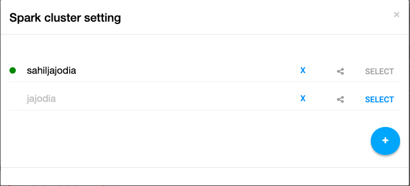
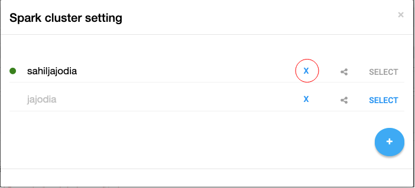
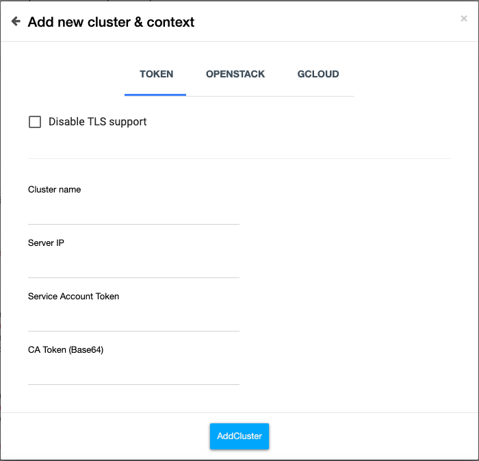
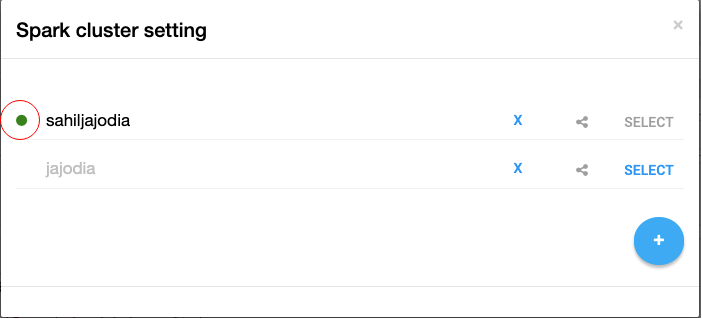
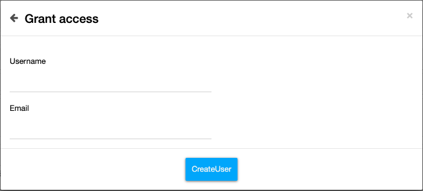
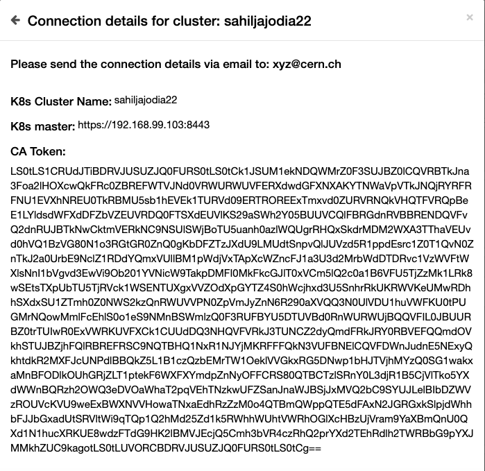

<a href="https://summerofcode.withgoogle.com/projects/#5318125807992832" target="_blank"></img></a>

# About the Project

### K8s Selection is a Jupyter Notebook extension which will be used at SWAN to support user managed kubernetes clusters. It will allow users to have disposible Kubernetes cluster running Spark to do data analysis inside SWAN. Currently it is integrated with a test version of SWAN.

### You can get the code for this project <a href="https://github.com/sahiljajodia01/k8s-selection" target="_blank">here</a>

## Some background on Jupyter Notebook Extensions
The Jupyter Notebook is an open-source web application that allows you to create and share documents that contain live code, equations, visualizations and narrative text. The basic need of this project was to create a Jupyter Notebook Extension. Jupyter Notebook extensions allow developers to extend the functionality of the Jupyter Notebook. Now, Jupyter notebook extensions can be of three formats - **NbExtensions** (They are JavaScript modules that you can load on in your Notebook’s frontend. This type of extension is exclusive to the Notebook frontend.), **ServerExtensions** (A server extension is a Python module that loads when the Notebook’s web server application starts. They can be used to provide the backend functionality in the extension.) and **KernelExtensions** (The IPython Kernel extension is just a Python module that can be used to modify the interactive shell environment. They also work as a backend and can be used to provide backend functionality. They can also interact with the frontend (NbExtensions) using Communication Manager.). In this project, I am using NbExtensions for the frontend and KernelExtensions for the backend.

## How Spark runs on Kubernetes
With large datasets (usually in TBs) at CERN, Apache Spark is the standard for doing analysis of these datasets. The starting point of doing data analysis using Spark at CERN is SWAN Notebooks. Now that Spark can run on a Kubernetes cluster, it is being used heavily at SWAN. At SWAN, we use Spark in Client mode. Spark has two types of Pods - A Spark Driver Pod and a Spark Executer Pod. The Spark Driver is the main Pod which manages all the Spark Executor Pods. In client mode, the Spark Driver remains on the host machine but the Spark Executer Pods are deployed on the target Kubernetes Cluster. Now as the Computations get bigger and bigger, Spark driver can just keep spawning the Spark Executor pods so that it can utilize full resources and we can get the results in less time. Also, the advantage of using Kubernetes as a cluster orchestration system is that we can leverage its strong resource sharing (RBAC) features.

## Why do we need this extension
This being the poject of SWAN, I will write this with respect to how it will be useful in SWAN. However, different organisations can have different use cases for this extension.

* Currently SWAN does not support user managed K8s clusters for Spark. This extension will allow the support of user managed clusters.
* After joining CERN, almost every user get some computing resources, but currently a user cannot use it for scalable
data analysis inside SWAN notebooks. This will allow them to quickly create cluster, use it and then dispose it again.
* If due to some reason the cluster is not responding, then currently it is hard to use another cluster. This extension can handle more than one cluster.
* Users (mostly physicists) of SWAN wants to do data analysis of the large datasets that they have using Spark. They dont want to execute complex kubernetes commands to setup K8s clusters for Spark. This extension serves them by doing most of the work in the backend.

## Features
Note: Here the word cluster always refers to a Kubernetes cluster.
* Parsing and showing all the clusters available to use from the KUBECONFIG file
    
    As shown in the above image, I am parsing all the clusters and contexts from the KUBECONFIG file, doing some processing in the backend to get the cluster's authentication method and remember it. Here as I am using Token authentication mode, the Share button is disabled. The `+` FAB can be used to go to the Add Cluster state.
* Delete obsolete or unused clusters from the KUBECONFIG file
    
    If you keep adding the cluster's one by one using this extension, the KUBECONFIG file can fill up very quickly and become messy. So there is always a delete option which you can use to delete the entities (cluster, context, user) from the KUBECONFIG file. And as my extension parses the KUBECONFIG file, it would be deleted from the above cluster list as well.
* Add your own cluster (if you are an admin) or Add clusters shared by admin to you, in the KUBECONFIG file. It allows a couple of different modes of authentication
    
    Here, I have created a tab layout for different modes of authentication. The token mode is the most basic and most widely used mode of authentication. However if you are using Openstack cloud in your organisation, it is always recommended that you use Openstack mode of authentication. Currently, at SWAN, Token mode is used but slowly Openstack mode of authentication is becoming the standard because it is more secure. Also, I have included the Gcloud mode but it is currently not implemented. It is just to show that this feature can be extended according to your needs.
* Displaying whether you are successfully connected to a cluster.
    
    Every cluster has a SELECT button. After you click on the select button, I perform checks in the background that whether you are currently reachable to this cluster or not and whether you are the admin of the cluster. Accordingly after getting the data on the frontend, I show the appropriate status and enable/disable the share button. If you are successfully connected to a cluster, you can offload Spark (currently) or any services to the cluster.
* You can share your cluster with other user (so that they can use your cluster to offload services). **This feature however currently only works for SWAN because sharing is very complex and every organisation has a different method for sharing resources. Also if sharing is not implemented properly, it could present some security issues. So in short, in SWAN, if the authentication mode is `Openstack` and if the user is `admin` of the cluster, then only the share button is enabled**.
    
    You can get to the above state after clicking on the share button. Here I take the CERN username of the user and also the email (which is almost always USER@cern.ch for CERN users). After clicking on the CreateUser button, I deploy the **Helm Chart** on the currently selected cluster. Now, Helm Chart is just a yaml file (basically yes but it is more complex than that) which can be used to deploy all the required resources from a single command, rather than using multiple commands. It also has other advantages which can be leveraged.
    
    After successfully adding a USER (basically creating a namespace and a rolebinding, CVMFS binding, etc using helm) to the cluster, the connection details is shown to the user. Currently I could not integrate the feature to send email directly to the user, but in the future we can add that functionality (Using the sendgrid API, that would be very easy).
    

## Future Work
The work that can be done to make this jupyter notebook extension more useful in the future.

* Adding GCloud (and similarly other) mode to use GKE clusters for spark
* Creating abstractions (functions) so it is easy to extend
* Making it useful for services other than spark. E.g Distributed Tensorflow (Currently it is only useful for Spark)

## Conclusion
To conclude the report I would say that the result of this project is an Easy to use jupyter notebook extension which has diverse use cases at SWAN and which allow users to take advantage of their resources and perform data analysis. Also, I would like to thank my mentors - **Prasanth Kothuri**, **Piotr Mrowczynski**, **Enric Tejedor Saavedra** and **Diogo Castro**. They helped me a lot during the project and helped me identify critical issues and bugs. Although this project was not very complex from the technology point of view but there were a lot of dots which were to be connected and I had to understand the working of 3 different systems (Jupyter Notebook extensions, Spark and Kubernetes) and my mentors helped me a lot to do that.

## References and Links
- <a href="https://github.com/sahiljajodia01/k8s-selection" target="_blank">Github Repository</a>
- <a href="https://docs.google.com/presentation/d/1K0XjJu5EAAVYTYyr_SYOGFIaPiLxWYqtzZJmzyK8IXM/edit?usp=sharing" target="_blank">Final Project Presentation</a>
- <a href="https://summerofcode.withgoogle.com/projects/#5318125807992832" target="_blank">GSoC Project Page</a>
- <a href="https://swan.web.cern.ch/" target="_blank">SWAN</a>
- <a href="https://jupyter-notebook.readthedocs.io/en/stable/extending/" target="_blank">Jupyter Notebook Extensions</a>
- <a href="https://spark.apache.org/docs/latest/running-on-kubernetes.html" target="_blank">Apache Spark on Kubernetes</a>
